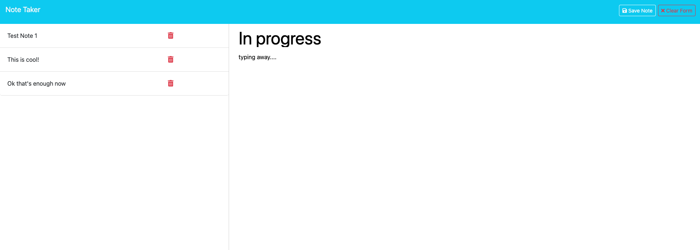

# Module 11 Challenge: Express.js - Note Taker

  ## Table of Contents
  - [Description](#description)
  - [Installation](#installation)
  - [Usage](#usage)
  - [Contributing](#contributing)
  - [Tests](#tests)
  - [License](#license)
  - [Credits](#credits)
  - [Questions](#questions)

  ## Description
  The Note Taker is an Express.js web app, which can be run from localhost or from a [deployed site on Render](https://note-taker-n2wc.onrender.com/), to write, save, view, and delete notes. The data is persistent across user sessions via a backend .json file and makes extensive use of express fs and path libraries to help the frontend code work with the data.

  ## Installation
  - This project requires project-level installs of Node and Express, both of which can be retrieved via npm i -y.
  - I also personally recommend a global install of nodemon, via npm i -g nodemon, but local will work too.

  ## Usage
  - To use this project locally, ensure you have the node packages installed as specified in the Installation section above. Then open a terminal on the project root and simply run nodemon server.js or node server.js - from there, just use the site and watch the magic unfold!
  - To use the project on Render, [simply navigate to the deployed site](https://note-taker-n2wc.onrender.com/); see my contact info in the Questions section if there are any issues with the program!

  

  ## Contributing
  If you would like to contribute to the project, get in touch with me via my contact info in the Questions section. I am always looking for suggestions on improving my work.

  ## Tests
  This app is best tested using nodemon and postman for just the GET/POST/DELETE API calls, but the interaction between the frontend and backend can also be tested directly on the browser using localhost:3001 and the console.
  
  ## Credits
  Frontend code and UUID helper function code were provided by U of M Bootcamp; All other backend code was developed by me.
    
  ## Questions
  - [Check me out on Github!](https://www.github.com/floatingpoint-exaflop)
  - [Email Me](mailto:timscallon1@gmail.com?subject=Hello!)

  ## License
  
  
  This project is using the MIT License. Please click the badge icon for more information, or refer directly to the LICENSE in the repo.